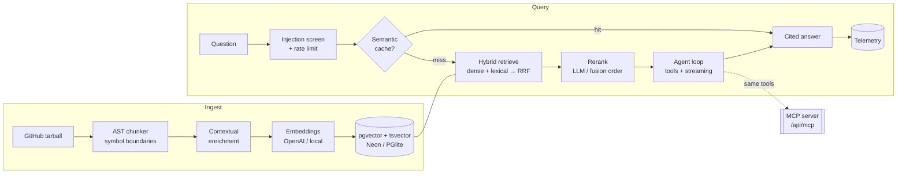

# RepoMind — Codebase Intelligence Agent

**▶ Live demo: https://repomind-teal.vercel.app** · [MCP endpoint](https://repomind-teal.vercel.app/api/mcp) · CI: typecheck + tests + eval gate + build

> The live demo boots with a pre-indexed sample service (`demo/acme-service`) so you can ask questions immediately — try *"How is authentication implemented?"* Paste any public repo (e.g. `honojs/hono`) to index your own.

Point it at any public GitHub repo. It ingests the code with **AST-aware chunking**, indexes it with **hybrid retrieval** (dense vectors + lexical BM25 fused with Reciprocal Rank Fusion, in one SQL query over pgvector), and lets you chat with an **agentic tool loop** that answers architecture, "where is X", and how-does-this-work questions — every claim carrying a **clickable citation back to the exact file and line**.

The same repo tools are exposed as an **MCP server** over Streamable HTTP, so Claude Desktop / Cursor can use the deployed backend directly. Retrieval quality is defended by an **eval harness** (recall@k · MRR · nDCG) wired as a **CI regression gate**.

> **Runs with zero API keys.** Missing keys degrade gracefully — an in-process Postgres (PGlite + pgvector) replaces Neon, and a deterministic local embedding + extractive answerer replace OpenAI. Add keys to upgrade quality, not to boot. This is why the CI suite and the Vercel demo work with no secrets.

---

## Why this project

It's built to show the surface area of a senior AI/ML engineer, end to end:

| Capability | What's actually implemented |
|---|---|
| **Retrieval engineering** | Dense (pgvector HNSW) + lexical (Postgres `tsvector`) **hybrid search fused with RRF inside a single SQL statement**, then an optional LLM reranker. Not a managed black box — the retrieval stack is owned. |
| **RAG quality technique** | **Contextual Retrieval** (Anthropic's method): each chunk is enriched with an LLM-generated situating summary before embedding, which lifts recall. Generated once at ingest. |
| **AST-aware chunking** | Splits code on real **symbol boundaries** (functions/classes/types) across TS/JS/Python/Go/Rust/Java/…, so chunks are semantically whole and citations name real symbols. |
| **Agentic tool use** | A bounded **agent loop** (AI SDK v5) with `search_code`, `read_file`, `list_symbols`, `repo_stats`. Streams its tool trace and tokens live. |
| **MCP** | The exact same tools re-exposed as a **Model Context Protocol** server — one implementation, two transports. |
| **Evaluation** | Golden Q&A set scored with **recall@k / MRR / nDCG**, an **ablation** (dense-only vs lexical-only vs hybrid), and a **CI gate** that fails the build on regression. |
| **Production concerns** | Prompt-**injection** screening, **semantic cache** (embedding-similarity answer reuse), **rate limiting**, and **token/cost tracing** on a live observability dashboard. |
| **Data engineering** | GitHub **tarball streaming** ingest (one request, not one-per-file), **content-hash incremental reindex** (only changed chunks re-embed; deleted chunks pruned). |
| **Dual backend** | Identical SQL over **Neon serverless Postgres** (prod) and **PGlite** (local/CI). Backend-agnostic app code. |

---

## Architecture



---

## Retrieval benchmark

From `npm run eval` (hermetic: fixture repo, local hashing embeddings, PGlite). The ablation is the point — **hybrid RRF fusion beats either arm alone on every metric**:

| Configuration | Recall@5 | MRR | nDCG@10 | Hit@5 |
|---|---:|---:|---:|---:|
| dense-only | 96.4% | 0.929 | 91.8% | 100% |
| lexical-only | 96.4% | 0.893 | 88.5% | 100% |
| **hybrid (RRF)** | **96.4%** | **1.000** | **95.5%** | **100%** |

14 golden questions spanning paraphrase (dense) and exact-token (lexical) queries. The CI gate fails the build if hybrid drops below recall@5 0.75 / MRR 0.60 / nDCG 0.65. With real OpenAI embeddings the absolute numbers rise further; these are a **regression floor**, not a ceiling.

---

## Run it locally

```bash
npm install
npm run dev            # http://localhost:3000 — works with no keys
```

Then paste a repo like `tiangolo/fastapi` (or click a sample) and ask questions.

```bash
npm test               # 22 tests: chunker, embeddings, metrics, + PGlite integration
npm run eval           # print the retrieval benchmark, write evals/results.json
npm run eval -- --ci   # same, but exit non-zero on regression (used in CI)
npm run typecheck      # strict TS, no errors
npm run build          # production build
```

### Optional configuration (`.env.local`)

Everything is optional — see [`.env.example`](.env.example).

| Var | Effect |
|---|---|
| `OPENAI_API_KEY` | Switches embeddings to `text-embedding-3-small` and enables the full LLM agent loop and LLM reranking. |
| `GEMINI_API_KEY` | Same, via Google AI Studio — `gemini-embedding-001` at 1536-d + `gemini-3.1-flash-lite`. Used when no OpenAI key is set. |
| `DATABASE_URL` | Neon serverless Postgres (needs the `vector` extension). Unset ⇒ in-process PGlite. |
| `GITHUB_TOKEN` | Raises GitHub rate limits and allows private repos. |
| `MCP_BEARER_TOKEN` | If set, the MCP endpoint requires `Authorization: Bearer <token>`. |
| `ADMIN_TOKEN` | If set, `DELETE /api/repos?id=…` (remove an index) requires the same bearer header. Unset ⇒ removal is open, like the rest of the demo API. |
| `CONTEXTUAL_LLM` | Opt in to LLM-generated contextual retrieval at ingest. Off by default: it costs one model call per chunk, which no serverless request budget survives. |

**Switching embedding providers requires a re-index.** Vectors from different
providers occupy different spaces, so a repo indexed under one and queried under
another returns noise. Each repo records the model it was built with; the UI marks
mismatched repos as *stale index* and refuses to answer from them, and re-ingesting
a repo whose provider changed drops its chunks and re-embeds instead of taking the
incremental path.

---

## Use it from Claude Desktop / Cursor (MCP)

The deployment is a live MCP server. Add to your client config:

```json
{
  "mcpServers": {
    "repomind": { "url": "https://<your-deployment>.vercel.app/api/mcp" }
  }
}
```

Tools exposed: `list_repos`, `search_code`, `read_file`, `list_symbols`, `repo_stats`.

---

## Deploy to Vercel

1. Push to GitHub, import the repo in Vercel (framework auto-detected).
2. It deploys and **runs with no env vars** (PGlite on `/tmp`, local models).
3. For durable, multi-instance storage and real LLM answers, add `DATABASE_URL` (Neon) and `OPENAI_API_KEY` in Project → Settings → Environment Variables, then redeploy.

> **Set `DATABASE_URL` before indexing your own repos.** Without it, PGlite lives in each
> serverless instance's own `/tmp`. A single page load fans out across several instances, so a repo
> ingested on one is invisible to the `/api/repos` and `/api/chat` calls routed to another — the
> ingest log reports success and the repo then appears to vanish. Every instance seeds the same demo
> repo so the deployment is never empty, but indexing real repos needs shared storage. Locally this
> never shows up: one dev server is one process.

---

## Layout

```
src/lib/db/         dual-backend Postgres (client, schema, vector helpers)
src/lib/ingest/     github tarball stream · AST chunker · contextual enrichment · pipeline
src/lib/retrieval/  hybrid RRF search (one SQL query) · reranker
src/lib/agent/      tools · agent engine · guardrails · semantic cache · rate limit
src/lib/eval/       IR metrics · harness (with ablation)
src/lib/obs/        token/cost accounting · telemetry
src/app/api/        chat · ingest · mcp · repos · stats · observability · eval · file
src/components/     premium streaming UI (chat, citations, code drawer, dashboards)
evals/              fixture repo · golden set · committed results.json
test/               vitest suites (unit + PGlite integration)
```

Built with Next.js 16, AI SDK v5, `@modelcontextprotocol/server` + `mcp-handler`, `@neondatabase/serverless`, `@electric-sql/pglite` + pgvector.
